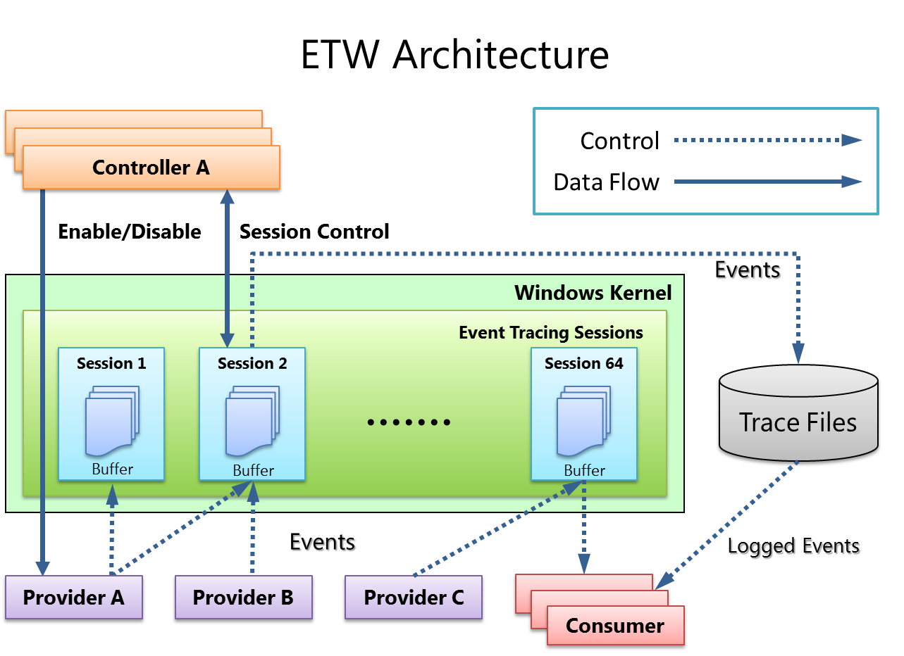

---
tags:
  - tool
---
# Logman

[Logman](https://learn.microsoft.com/en-us/windows-server/administration/windows-commands/logman) is a native command-line tool for Windows that serves as an example of an _ETW controller_. It enables users to initiate and terminate ETW tracing sessions. These tracing sessions capture events that are then stored in files specifically designed for tracing which are typically identified by the `.etl` file extension.

## Capabilities

```powershell
# See help menu
logman /?

# List ETW providers
logman query providers

# Query information on an individual ETW provider
logman query providers $PROVIDER_NAME

# List tracing sessions
logman query -ets

# Query information on an individual ETW tracing session
logman query $SESSION_NAME -ets

# Start an ETW tracing session (REQUIRES ADMINISTRATOR)
logman create trace $SESSION_NAME -o C:\$PATH\$TO\$ETW_FILE -p $PROVIDER_NAME -ets

# Stop corresponding ETW tracing session
logman stop $SESSION_NAME -ets
```

**Note:** The `-ets` flag will send commands directly to the tracing session without saving or scheduling the session for future use.

## ETW Refresher

Trace files (`.etw`) can be viewed with Event Viewer by selecting Action -> Open Saved Log.


